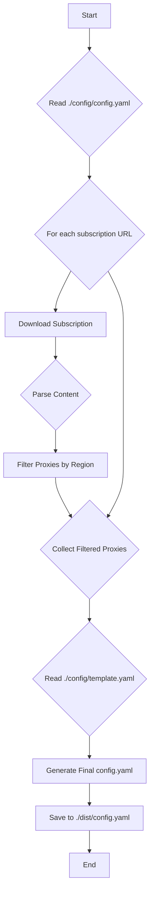

# Clash Auto Updater - Architecture Design

This document outlines the architecture and workflow for the Clash Auto Updater tool.

## 1. High-Level Workflow

The following diagram illustrates the main steps of the process:



## 2. Project Structure

The proposed project structure will be as follows:

```
clash-auto/
├── .claude/
│   └── architecture.md
├── cmd/
│   └── clash-auto/
│       └── main.go         # Main application entry point
├── internal/
│   ├── config/             # Configuration loading and management
│   │   └── config.go
│   ├── downloader/         # Subscription downloading
│   │   └── downloader.go
│   ├── parser/             # Subscription content parsing
│   │   └── parser.go
│   ├── filter/             # Proxy filtering logic
│   │   └── filter.go
│   └── generator/          # Final config.yaml generation
│       └── generator.go
├── config/
│   ├── config.yaml.example # Example configuration file
│   └── template.yaml       # Clash base template
├── dist/
│   └── .gitkeep            # Directory for generated config
├── go.mod
├── go.sum
└── README.md
```

## 3. Configuration File (`config/config.yaml`)

The configuration file will manage user settings.

```yaml
# config/config.yaml

# List of subscription URLs to fetch
subscriptions:
  - "https://example.com/sub1.txt"
  - "https://example.com/sub2.txt"

# Rules for filtering proxies. 
# Proxies whose names contain any of these keywords will be included.
filter_rules:
  include_keywords:
    - "HK"
    - "香港"
    - "SG"
    - "新加坡"
    - "JP"
    - "日本"

# Path to the base Clash template
template_path: "./config/template.yaml"

# Path for the final generated config file
output_path: "./dist/config.yaml"
```

This plan provides a solid foundation for the development phase.